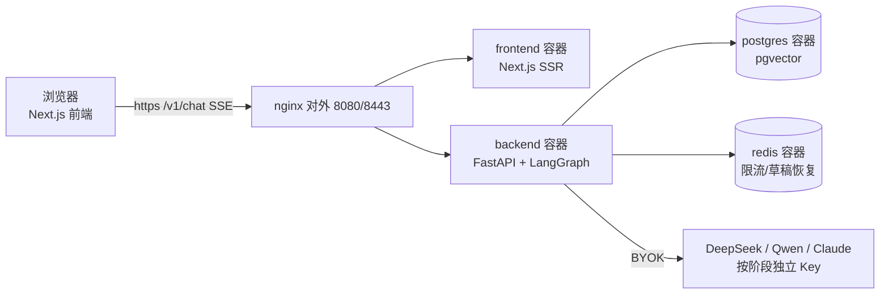

# novel-agent — AI 小说创作平台

三阶段 LLM 流水线（草稿 → 精修 → 评估）+ 实时流式输出 + BYOK 多 provider + RAG 记忆检索 + 人物关系图 + 章节上下文注入与字数控制。

> **5 分钟跑起来**：[QUICKSTART.md](QUICKSTART.md) ｜ **服务器部署**：[deploy/README.md](deploy/README.md) ｜ **上手配方**：[docs/recipes/index.md](docs/recipes/index.md) ｜ **功能部件总览图**：[docs/diagrams/agents.html](docs/diagrams/agents.html)

## 技术栈

| 层 | 选型 |
|---|---|
| 后端 | Python 3.11 + FastAPI + LangGraph + LiteLLM |
| LLM | BYOK：草稿 DeepSeek / 精修 Qwen / 评估 Claude（可自选） |
| 数据库 | PostgreSQL 16 + pgvector + Redis |
| 前端 | Next.js 14 + TailwindCSS + Tiptap |
| 依赖 | Python 用 uv（`backend/pyproject.toml`），Node 用 npm |

## 快速开始

前置：Docker Desktop（WSL2 后端）。

```powershell
# 0. 生成自签 TLS 证书（nginx 启动必需；仅本机 https://localhost:8443 用，正式域名走 certbot，见 deploy/README.md）
mkdir deploy/nginx/certs
# openssl 不在 PATH？Windows 一般没有——Git for Windows 自带，与 git 同目录：
$openssl = Join-Path (Split-Path (Get-Command git).Source -Parent) "openssl.exe"
& $openssl req -x509 -nodes -newkey rsa:2048 `
  -keyout deploy/nginx/certs/privkey.pem `
  -out deploy/nginx/certs/fullchain.pem -days 365 -subj "/CN=localhost"

# 1. 容器密钥（根目录，强密码，.env.example 已预生成直接可用）
Copy-Item .env.example .env
# 2. API Key（后端）
cd backend && Copy-Item .env.example .env   # 填 DEEPSEEK_API_KEY / DASHSCOPE_API_KEY 等
# 3. 构建启动全栈（nginx + PG + Redis + backend + frontend）
docker compose up -d --build
# 4. 初始化数据库
docker compose exec backend alembic upgrade head
docker compose exec backend python scripts/check_migrations.py
```

访问 **https://localhost:8443** → 点击 ⚙ 配置 API Key → 开始写作。

> 端口仅 nginx 暴露 80/443（宿主 8080/8443 映射），其余服务内网互连；数据保存在 Docker 卷，删容器不丢。

## 架构



- **容器 = 镜像的运行实例**。`docker compose up -d --build` 把 5 个镜像各起一个容器，并搭好内部网络。容器之间用内部名字互连（`postgres`/`redis`/`backend`/`frontend`），只有 nginx 对外开 8080/8443 端口。
- **仓库只保留源代码**：应用全部在 Docker 内构建运行（backend/frontend 各有 Dockerfile）；`.venv`/`node_modules`/构建产物均不入库。

## 功能总览

### ✍️ 写作核心

| 功能 | 说明 |
|---|---|
| 三阶段流水线 | 检索记忆 → 草稿 → 精修循环 → 多维评审 → 安全检查；SSE 逐字流式 + 顶部阶段进度条实时点亮 |
| 任务路由 | `[task:TYPE]` 短路：生成/续写走完整链，重写/润色直达精修——快且省 token |
| 章节上下文注入 | 写作时自动注入 章节进度 / 前文梗概 / 人物关系树 / 字数目标（system prompt 注入） |
| 字数控制 | 按前几章中位数自动推导目标（±15%），不足自动续写补足 |
| AI 段落标记 | AI 生成段落带左侧标记，重开后仍可识别（`ai_paragraphs` 持久化） |
| 分段压缩 | AI 场景间多余空行自动折叠为单空段落 |

### 🧠 记忆系统

| 功能 | 说明 |
|---|---|
| RAG 记忆检索 | 章节 / 人物 / 世界观 / 剧情事件 / 知识文档 5 集合向量检索（pgvector，4096 维全精度） |
| 记忆库页面 | `/novels/[id]/memory` 六类记忆（含人物关系）一站式看全 / 搜索 / 删除 / 上传知识文档 |
| 后台嵌入 | 保存不卡顿——写事务与向量索引解耦，嵌入后台异步完成；「索引中→✓已索引」徽标提示 RAG 可用 |
| 灵感套件 | 一键生成世界观（3-5 条）+ 人物卡（6-10 张，唯一主角+多卡型防重复）+ 关系网（6-12 条）+ 主线大纲，原子应用入库 |
| 大纲实体提取 | 从大纲一键提取人物/世界观/剧情事件批量建档（409 重复自动识别） |

### 🕸️ 可视化

| 功能 | 说明 |
|---|---|
| 人物关系图 | 小点+全名节点，力导向布局；关系强度 1-5 星；侧栏 200px 与全屏页皆可读 |
| 时间线因果图 | 分层 DAG——事件按前驱指针自动分叉分层，圆点+右侧单行标签，规模任意增长不挤 |
| 剧情面板前驱下拉 | 创建/编辑事件时选「前驱事件」，客户端环路预检（成环候选禁用），列表带 `↳#id` 因果徽标 |
| 大纲脑图 | OutlineMindMap 可视化章节大纲 |
| 全屏页 | `/novels/[id]/graph?tab=graph\|timeline`，编辑器侧栏 ⤢ 一键跳转 |

### 🛡️ 安心写作

| 功能 | 说明 |
|---|---|
| 章节快照 | 每次保存/大改自动快照，随时回溯 |
| 交稿雷达 | 发布前安全扫描（规则引擎，safety_check 阶段） |
| 时间线一致性校验 | 章节保存时实时校验因果顺序/日期倒置，警告写入 `timeline_warnings` |
| 回收站 | 删除=软删（可恢复）；头部「回收站」入口，支持恢复/永久删除 |
| 导出 | MD / TXT / EPUB / 平台格式 |
| 查找替换 | 全文查找替换，独立面板 |

### ⚙️ 平台与配置

| 功能 | 说明 |
|---|---|
| BYOK 多 provider | 网页 ⚙ 填 key：草稿/精修/评估/嵌入 4 阶段独立配置，SSRF 校验，按阶段路由 |
| 网站鉴权 | `API_KEYS` 白名单（空=开放模式）；配置后需 `X-API-Key` |
| 限流 | Redis 每 key 60s 窗口（chat 10 次/分，测试端点 3 次/分） |
| 多作品类型 | 长篇 / 短篇 / 剧本 / 视频 四类 tab + 搜索 + 分页 |
| 创作向导 | 新书三步引导（设定→大纲→应用） |

## 日常写作流

```text
新书：创作向导三步（设定→大纲→应用）→ 逐章生成
逐章：选章 → 看到大纲梗概 → 点续写/生成 → 编辑改写 → 换章继续
打磨：选中不满意的段落 → 扩写/重写/降AI → 定稿
构思：卡壳时切「AI 编剧」→ 多轮对话问情节/人物 → 回工具继续写
记忆：编辑器字数条「🧠 记忆库」→ 整理六类记忆 / 上传设定资料
复盘：剧情面板补前驱 → 时间线看因果分叉 → 关系图理人物网
```

## 验证清单

| 项 | 期望 |
|---|---|
| `docker compose ps` | 5 容器 running，postgres/redis healthy |
| `curl -k https://localhost:8443/v1/health` | `{"status":"ok"}` |
| 浏览器 https://localhost:8443 | 编辑器界面 |
| 配置 BYOK → 测试连接 | ✅ 连接成功 |
| 点击"续写" | ~1-2s 后文字逐字出现 + 顶部阶段进度点亮 |

## 常见问题

- **拉取镜像慢/失败**：配置 Docker 镜像加速器（Docker Desktop → Settings → Docker Engine 加 `registry-mirrors`，如 `docker.xuanyuan.me` / `docker.1ms.run`）。
- **Redis 连接失败**：`docker compose ps` 确认容器 running，否则 `docker compose up -d`。
- **迁移双头**：用 `check_migrations.py` / `alembic heads` 核对，分叉先合并链再升级。
- **`litellm` 升级失败**：`litellm==1.90.7`（<1.91 硬约束，1.91+ 引入 Rust 组件）。
- **重建虚拟环境**：`cd backend && rm -r .venv && uv sync --locked`（仅本地进程开发需要；容器部署无需）。

## 本地开发（非容器路径）

日常开发**仍推荐 Docker 全栈**；需要本地起后端进程（如调试 attach）时：

```powershell
# Python 一律用 uv 管理虚拟环境（必要约束，勿用 pip/conda 手搓）
cd backend
uv sync --locked              # 按 uv.lock 精确重建 .venv
uv run uvicorn app.main:app --reload   # DB/Redis 用 compose 栈的
uv run pytest tests/ -q       # 跑测试也在 uv run 下
```

前端：`npm ci && npm run dev`（Node 侧不用 uv）。

**浏览器调用约定（本机）**：本项目自动化/测试需要浏览器时，只用 `D:\develop\hermes\chrome\` 下的 Chromium（`chromium-1243\chrome-win64\chrome.exe`），不得访问系统其他位置的 Chrome/Edge——Playwright 传 `executablePath` 指向该路径。

## 开发约定

- **提交**：Conventional Commits（`feat:` / `fix:` / `docs:` / `chore:` 等）
- **测试**：新增功能必带测试，覆盖率 ≥ 80%；DB 查询配 fake-session 回归测试防静默退化
- **依赖**：不换框架；LiteLLM 是唯一 LLM 入口且 `==` 精确 pin；**Python 依赖一律 uv**（`uv sync --locked` 构建虚拟环境，版本以 `backend/uv.lock` 为准）
- **浏览器**：自动化只用 `D:\develop\hermes\chrome\` 的 Chromium，不访问其他位置
- **鉴权**：受保护端点默认开放模式（未配置 `API_KEYS` 时放行）；配置后需 `X-API-Key`（前端「网站鉴权 Key」填写）
- **数据绑定命名**：`POSTGRES_DB`（`project11`）与 Redis 密码前缀保留旧名——改动会使现有 Docker 卷数据失联；容器名/展示名已统一 `novel-agent`
