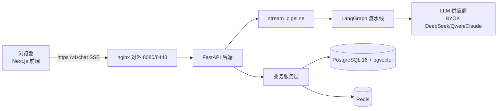
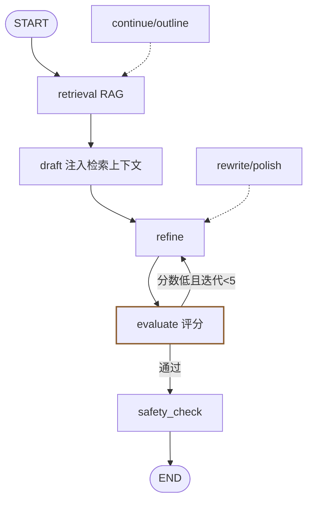

# Project11 — AI 小说创作平台

三阶段 LLM 流水线（草稿 → 精修 → 评估）+ 实时流式输出 + BYOK 多 provider + RAG 记忆检索。

> **5 分钟跑起来**：[QUICKSTART.md](QUICKSTART.md) ｜ **服务器部署**：[deploy/README.md](deploy/README.md) ｜ **上手配方**：[docs/recipes/index.md](docs/recipes/index.md)

## 技术栈

| 层 | 选型 |
|---|---|
| 后端 | Python 3.11 + FastAPI + LangGraph + LiteLLM |
| LLM | BYOK：草稿 DeepSeek / 精修 Qwen / 评估 Claude（可自选） |
| 数据库 | PostgreSQL 16 + pgvector + Redis |
| 前端 | Next.js 14 + TailwindCSS + Tiptap |
| 依赖 | Python 用 uv（`backend/pyproject.toml`），Node 用 npm |

## 快速开始

前置：Docker Desktop（WSL2 后端）。

```powershell
# 0. 生成自签 TLS 证书（nginx 启动必需；仅本机 https://localhost:8443 用，正式域名走 certbot，见 deploy/README.md）
mkdir deploy/nginx/certs
# openssl 不在 PATH？Windows 一般没有——Git for Windows 自带，与 git 同目录：
$openssl = Join-Path (Split-Path (Get-Command git).Source -Parent) "openssl.exe"
& $openssl req -x509 -nodes -newkey rsa:2048 `
  -keyout deploy/nginx/certs/privkey.pem `
  -out deploy/nginx/certs/fullchain.pem -days 365 -subj "/CN=localhost"

# 1. 容器密钥（根目录，强密码，.env.example 已预生成直接可用）
Copy-Item .env.example .env

# 2. API Key（后端）
cd backend && Copy-Item .env.example .env   # 填 DEEPSEEK_API_KEY / DASHSCOPE_API_KEY 等

# 3. 构建启动全栈（nginx + PG + Redis + backend + frontend）
docker compose up -d --build

# 4. 初始化数据库
docker compose exec backend alembic upgrade head
docker compose exec backend python scripts/check_migrations.py
```

访问 **https://localhost:8443** → 点击 ⚙ 配置 API Key → 开始写作。
健康检查：`curl -k https://localhost:8443/v1/health` → `{"status":"ok"}`

> 本地进程热重载（改代码免 rebuild）：`uv run uvicorn app.main:app --reload --port 8000` + `npm run dev`，DB 仍用 compose 栈。

### 从零彻底重建（清容器 + 数据 + 镜像）

```powershell
docker compose down -v        # 停容器 + 删数据卷
docker compose rm -f          # 删容器（保险）
docker image prune -a         # 删本地镜像（重建会重新拉基础镜像）
# 然后重跑上面「快速开始」步骤 0-4 即可
```

> `deploy/nginx/certs/` 不入库（gitignore）；丢了就重跑步骤 0。`pg_data`/`redis_data` 是数据卷，`down` 保留、`down -v` 清除（清后需重新迁移）。

## 常用命令

```powershell
docker compose up -d          # 启动全栈
docker compose down           # 停止（保留数据卷）
docker compose down -v        # 停止并清卷（需重新迁移）
docker compose logs -f backend
docker compose exec backend alembic upgrade head   # 更新后补迁移
```

## 核心特性

- **task_type 路由**：按任务走最少 pipeline 阶段（续写 ~2s 出首字，不走评估循环）
- **真流式输出**：逐 token 经 SSE 实时推送，前端逐字渲染
- **阶段级降级**：单阶段失败跳过并标注，pipeline 继续
- **BYOK**：三段各配独立 provider，快速预设 + 连接测试
- **RAG 记忆检索**：章节/角色/世界观/剧情四集合 pgvector 检索，小说设定优先
- **多 Agent 系统**：大纲角色 / 章节编辑 / 评估矩阵 / 安全审核
- **作品导出**：md / txt / epub（零新依赖）
- **写作工具**：生成总纲 / 续写 / 扩写 / 重写 / 降AI / 编剧对话 / 知识库 / 统计看板

## 架构

**整体拓扑**：`浏览器 → nginx(对外 8080/8443, TLS+CSP) → FastAPI 后端 → [LangGraph 流水线 → litellm → BYOK LLM] + [PostgreSQL/pgvector + Redis]`



**Pipeline 路由**（按 `task_type` 取最少阶段链，评估不过最多循环 5 次）：



**阶段链**：`generate` 全链 + 循环 ｜ `continue`/`outline` retrieval→draft→safety ｜ `rewrite`/`polish` refine→safety。

**BYOK**：前端 `X-Provider-Config` 头上传分段凭证，后端 SSRF 校验 api_base（`APIBaseNotAllowed`），日志脱敏（`_redact_key`）。
**RAG**：retrieval_node 在 draft 前对 4 集合（章节/角色/世界观/事件）pgvector 语义检索，注入 draft/refine 提示词；失败降级不阻断。
**数据**：PostgreSQL 16 + pgvector（Alembic 迁移，`check_migrations.py` 前置校验）；Redis 缓存/限流。

> 完整交互式版本：`docs/diagrams/architecture.html`

## 运作原理（通俗版）

> 没接触过 Docker 也不怕，这一节用大白话讲清"代码到底怎么变成能用的网站"。

### 1. 镜像和容器存在哪

- **镜像 / 容器 / 数据卷，全都存在一个虚拟磁盘文件里**（Docker Desktop 用 WSL2 后端，相当于一个隐藏的 Linux 虚拟机）：
  `E:\docker\dockerdata\DockerDesktopWSL\disk\docker_data.vhdx`（8GB 左右，随内容增长）
- 这个文件就像一个大"U 盘镜像"：删了它 = 镜像、容器、数据全没。**日常清理用 Docker 命令，不要直接动这个文件**。
- 数据卷（`pg_data` / `redis_data`，存你的作品数据）也在这个文件里，`docker compose down` 不删，`down -v` 才删。

### 2. 从源码到成品运行：四步

```text
源代码(.py/.tsx) ──① Dockerfile 定义"菜谱"──▶ 镜像(不可变快照) ──② docker compose 启动──▶ 容器(运行中的实例) ──③ 内部网络互通──▶ 整个网站跑起来
```

1. **源码 ≠ 能跑**：`.py` 需要 Python 环境，`.tsx` 需要 Node 环境。源码是"原料"。
2. **Dockerfile = 菜谱**，告诉 Docker 怎么把原料做成"可运行快照（镜像）"：
   - `backend/Dockerfile`：装 Python 3.11 → 装依赖 → 拷源码 → 启动 `uvicorn`（后端服务）
   - `frontend/Dockerfile`：装 Node → `npm build` 打包前端 → 交给 nginx 托管
3. **镜像 = 打包好的成品**（不可变，可复制到任何机器跑）。你项目里 5 个镜像 = 2 个自己构建（backend/frontend）+ 3 个从 Docker Hub 远端拉取（`nginx:alpine` / `redis:7-alpine` / `pgvector/pgvector:pg16`，即网关、缓存、数据库的官方成品）。
4. **容器 = 镜像的运行实例**。`docker compose up -d --build` 把 5 个镜像各起一个容器，并搭好内部网络。容器之间用内部名字互连（`postgres`/`redis`/`backend`/`frontend`），只有 nginx 对外开 8080/8443 端口。

**改代码后为什么没变？** 因为容器跑的是镜像里的旧快照。改完要重新"做菜"：`docker compose build backend`（重新生成镜像）→ `docker compose up -d backend`（换新容器）。

### 3. 源码都是干什么的（速览）

| 目录 | 通俗解释 |
|---|---|
| `backend/app/main.py` | 后端"总开关"，创建 FastAPI 应用，挂载所有接口 |
| `backend/app/api/` | 接口层：每个文件是一类接口（聊天/作品/章节/角色/设定/导出/统计…），收到前端请求后调业务层 |
| `backend/app/pipeline/` | **核心**：三阶段写作流水线（草稿→精修→评估→安全），按任务类型走不同路径 |
| `backend/app/llm/` | 调用 AI 供应商的封装（litellm），处理 BYOK 凭证、SSRF 校验、重试 |
| `backend/app/services/` | 业务逻辑（文档/章节/角色/检索等操作数据库） |
| `backend/app/models/` | 数据库表结构（SQLAlchemy ORM），一章一个模型 |
| `backend/app/schemas/` | 接口的输入输出格式（Pydantic），数据校验 |
| `backend/app/eval/` | 评估矩阵：给生成内容打分（连贯/角色一致/文笔/剧情逻辑…） |
| `backend/app/safety/` | 内容安全规则引擎（敏感表达检查） |
| `backend/app/agents/` + `planner/` | 大纲角色 / 编辑器等"智能体"与 DAG 编排 |
| `backend/app/tools/` | 工具注册表（AI 可用的内置工具） |
| `backend/alembic/` | 数据库"版本管理"（迁移脚本），改表结构用 |
| `backend/scripts/` | 运维脚本（迁移前校验等） |
| `backend/tests/` | 后端测试 |
| `frontend/src/app/` | 页面路由（编辑器/作品列表/统计等） |
| `frontend/src/components/` | 页面里的组件（编辑区/角色面板/AI工具面板/设置…） |
| `frontend/src/lib/` | 前端工具函数 + 调用后端 API 的封装 |
| `frontend/src/middleware.ts` | CSP 安全：每请求生成一次性 nonce，防 XSS |
| `docker-compose.yml` | 5 个服务的编排总表（镜像、端口、环境变量、依赖关系） |
| `deploy/nginx/app.conf` | nginx 配置：TLS 终止、反代到前端/后端、安全响应头 |

### 4. 一次请求是怎么走完的

```text
浏览器(https://localhost:8443) → nginx(收请求,解密 TLS) → frontend(页面渲染)
  用户点"续写" → frontend 发 POST /v1/chat → nginx → backend
  backend 跑流水线: 检索记忆→草稿→精修→评估→安全检查 → 调 LLM(DeepSeek等)
  结果逐字 SSE 流回 → 前端逐字显示
  正文保存 → backend 写 PostgreSQL(内容) + Redis(缓存/限流)
```

## API 一览

| 方法 | 路径 | 说明 |
|---|---|---|
| POST | `/v1/chat` | 流式聊天（SSE，含 task_type 路由） |
| POST | `/v1/chat/test` | 连接测试 |
| GET | `/v1/health` | 健康检查 |
| CRUD | `/v1/documents/...` / `chapters/` / `characters/` / `world-settings/` / `plot-events/` | 作品内容管理 |
| POST | `/v1/documents/{id}/retrieve` | RAG 语义检索 |
| GET | `/v1/documents/{id}/export?format=md|txt|epub` | 作品导出 |
| GET | `/v1/stats/dashboard` | 写作统计 |
| CRUD | `/v1/documents/{id}/knowledge-docs` | 知识库 |

> 受保护端点鉴权默认**开放模式（fail-open）**：未配置 `API_KEYS` 时直接放行，前端无需填网站鉴权 Key 即可使用。配置 `API_KEYS`（白名单 JSON，见 `.env.example`）后转为强制校验，请求需带 `X-API-Key`（前端设置弹窗「网站鉴权 Key」填写）。

## 验证清单

| 项 | 期望 |
|---|---|
| `docker compose ps` | 5 容器 running，postgres/redis healthy |
| `curl -k https://localhost:8443/v1/health` | `{"status":"ok"}` |
| 浏览器 https://localhost:8443 | 编辑器界面 |
| 配置 BYOK → 测试连接 | ✅ 连接成功 |
| 点击"续写" | ~1-2s 后文字逐字出现 |

## 常见问题

- **拉取镜像慢/失败**：配置 Docker 镜像加速器（Docker Desktop → Settings → Docker Engine 加 `registry-mirrors`，如 `docker.xuanyuan.me` / `docker.1ms.run`）。
- **Redis 连接失败**：`docker compose ps` 确认容器 running，否则 `docker compose up -d`。
- **迁移双头**：用 `check_migrations.py` / `alembic heads` 核对，分叉先合并链再升级。
- **`litellm` 升级失败**：`litellm==1.90.7`（<1.91 硬约束，1.91+ 引入 Rust 组件）。
- **重建虚拟环境**：`cd backend && rm -r .venv && uv sync --locked`。

## 开发约定

- **提交**：Conventional Commits（`feat:` / `fix:` / `docs:` / `chore:` 等）
- **测试**：新增功能必带测试，覆盖率 ≥ 80%
- **依赖**：不换框架；LiteLLM 是唯一 LLM 入口且 `==` 精确 pin；Python 依赖用 uv，版本以 `backend/uv.lock` 为准
- **AI 协作**：[AGENTS.md](AGENTS.md)