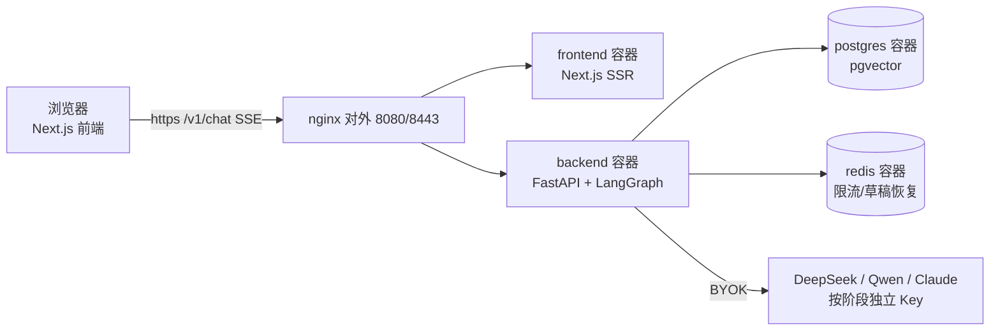

# novel-agent — AI 小说创作平台

三阶段 LLM 流水线（草稿 → 精修 → 评估）+ 实时流式输出 + BYOK 多 provider + RAG 记忆检索 + 人物关系图 + 章节上下文注入与字数控制。

> **5 分钟跑起来**：[QUICKSTART.md](QUICKSTART.md) ｜ **服务器部署**：[deploy/README.md](deploy/README.md) ｜ **上手配方**：[docs/recipes/index.md](docs/recipes/index.md)

## 技术栈

| 层 | 选型 |
|---|---|
| 后端 | Python 3.11 + FastAPI + LangGraph + LiteLLM |
| LLM | BYOK：草稿 DeepSeek / 精修 Qwen / 评估 Claude（可自选） |
| 数据库 | PostgreSQL 16 + pgvector + Redis |
| 前端 | Next.js 14 + TailwindCSS + Tiptap |
| 依赖 | Python 用 uv（`backend/pyproject.toml`），Node 用 npm |

## 快速开始

前置：Docker Desktop（WSL2 后端）。

```powershell
# 0. 生成自签 TLS 证书（nginx 启动必需；仅本机 https://localhost:8443 用，正式域名走 certbot，见 deploy/README.md）
mkdir deploy/nginx/certs
# openssl 不在 PATH？Windows 一般没有——Git for Windows 自带，与 git 同目录：
$openssl = Join-Path (Split-Path (Get-Command git).Source -Parent) "openssl.exe"
& $openssl req -x509 -nodes -newkey rsa:2048 `
  -keyout deploy/nginx/certs/privkey.pem `
  -out deploy/nginx/certs/fullchain.pem -days 365 -subj "/CN=localhost"

# 1. 容器密钥（根目录，强密码，.env.example 已预生成直接可用）
Copy-Item .env.example .env

# 2. API Key（后端）
cd backend && Copy-Item .env.example .env   # 填 DEEPSEEK_API_KEY / DASHSCOPE_API_KEY 等

# 3. 构建启动全栈（nginx + PG + Redis + backend + frontend）
docker compose up -d --build

# 4. 初始化数据库
docker compose exec backend alembic upgrade head
docker compose exec backend python scripts/check_migrations.py
```

访问 **https://localhost:8443** → 点击 ⚙ 配置 API Key → 开始写作。

> 端口仅 nginx 暴露 80/443（宿主 8080/8443 映射），其余服务内网互连；数据保存在 Docker 卷，删容器不丢。

## 架构



- **容器 = 镜像的运行实例**。`docker compose up -d --build` 把 5 个镜像各起一个容器，并搭好内部网络。容器之间用内部名字互连（`postgres`/`redis`/`backend`/`frontend`），只有 nginx 对外开 8080/8443 端口。
- **仓库只保留源代码**：应用全部在 Docker 内构建运行（backend/frontend 各有 Dockerfile）；`.venv`/`node_modules`/构建产物均不入库。

## 核心能力

- **三阶段流水线**：检索记忆 → 草稿 → 精修循环 → 多维评审 → 安全检查；SSE 流式输出 + 阶段进度可视化
- **章节上下文注入**：写作时自动注入 章节进度 / 人物关系树 / 前文梗概 / 字数目标（system prompt 注入，不污染 RAG 检索缓存）
- **字数控制**：按前几章中位数自动推导目标（±15%），不足自动续写补足
- **人物关系图**：一键从大纲提取关系，可视化图上拖连改关系（`/v1/documents/{id}/characters/relationships`）
- **RAG 记忆**：角色/世界观/剧情/章节 5 集合向量检索 + 结构化 lore 兜底
- **安心写作**：章节快照回溯、交稿雷达（安全扫描）、导出（MD/TXT/EPUB/平台格式）

## 日常写作流

```text
新书：创作向导三步（设定→大纲→应用）→ 逐章生成
逐章：选章 → 看到大纲梗概 → 点续写/生成 → 编辑改写 → 换章继续
打磨：选中不满意的段落 → 扩写/重写/降AI → 定稿
构思：卡壳时切「AI 编剧」→ 多轮对话问情节/人物 → 回工具继续写
```

## 验证清单

| 项 | 期望 |
|---|---|
| `docker compose ps` | 5 容器 running，postgres/redis healthy |
| `curl -k https://localhost:8443/v1/health` | `{"status":"ok"}` |
| 浏览器 https://localhost:8443 | 编辑器界面 |
| 配置 BYOK → 测试连接 | ✅ 连接成功 |
| 点击"续写" | ~1-2s 后文字逐字出现 + 顶部阶段进度点亮 |

## 常见问题

- **拉取镜像慢/失败**：配置 Docker 镜像加速器（Docker Desktop → Settings → Docker Engine 加 `registry-mirrors`，如 `docker.xuanyuan.me` / `docker.1ms.run`）。
- **Redis 连接失败**：`docker compose ps` 确认容器 running，否则 `docker compose up -d`。
- **迁移双头**：用 `check_migrations.py` / `alembic heads` 核对，分叉先合并链再升级。
- **`litellm` 升级失败**：`litellm==1.90.7`（<1.91 硬约束，1.91+ 引入 Rust 组件）。
- **重建虚拟环境**：`cd backend && rm -r .venv && uv sync --locked`（仅本地进程开发需要；容器部署无需）。

## 开发约定

- **提交**：Conventional Commits（`feat:` / `fix:` / `docs:` / `chore:` 等）
- **测试**：新增功能必带测试，覆盖率 ≥ 80%；DB 查询配 fake-session 回归测试防静默退化
- **依赖**：不换框架；LiteLLM 是唯一 LLM 入口且 `==` 精确 pin；Python 依赖用 uv，版本以 `backend/uv.lock` 为准
- **鉴权**：受保护端点默认开放模式（未配置 `API_KEYS` 时放行）；配置后需 `X-API-Key`（前端「网站鉴权 Key」填写）
- **数据绑定命名**：`POSTGRES_DB`（`project11`）与 Redis 密码前缀保留旧名——改动会使现有 Docker 卷数据失联；容器名/展示名已统一 `novel-agent`
